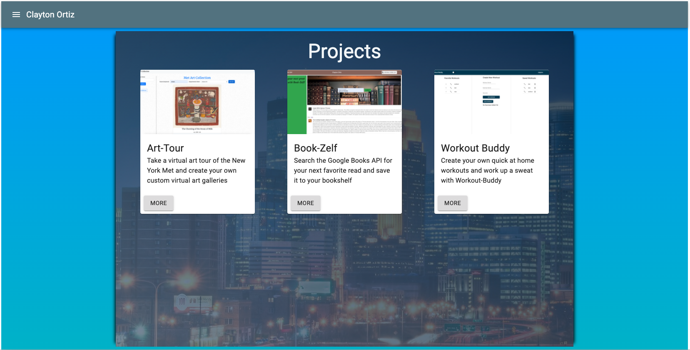

This is my personal portfolio site built with React and Material-Ui. It is all on a single page and contains a projects and about section. I am using Google Firebase to host the site. There is no database associated with the site, any data used is from a small JSON file. The hamburger menu in the top left contains links to my GitHub, LinkedIn, Resume and opens an email launch. The Projects section is below the About section. It contains three full stack applications with short descriptions of each. The more button on the bottom of the card opens a modal that displays the different tech used in each application and links to the respective repositories and live sites. At the bottom of the page is the footer which links to my GitHub, LinkedIn and an email launch.

